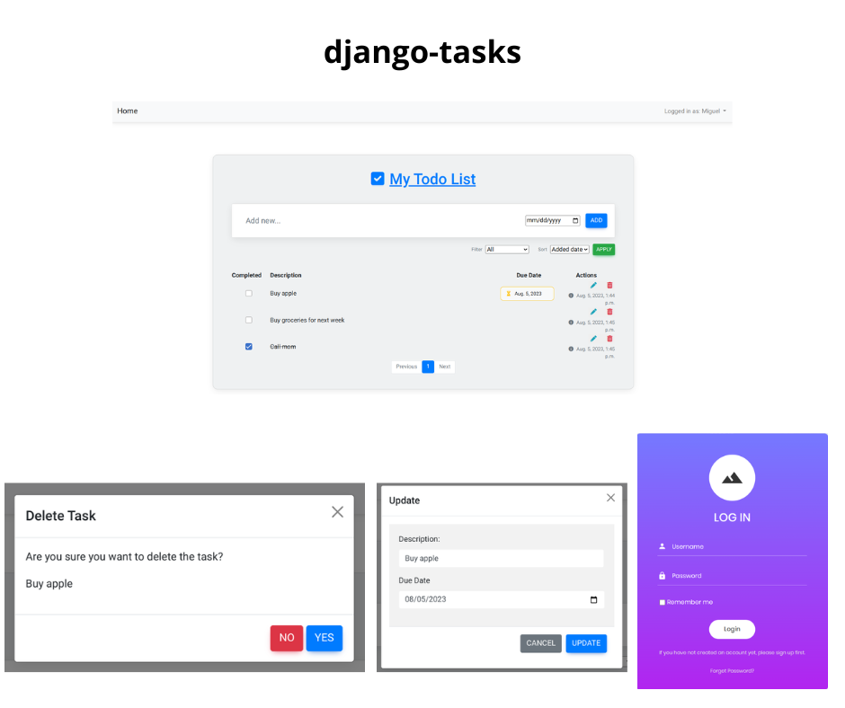

# <p align="center">[Django] Task Manager: Organize Your To-Do List</p>

[django-allauth]: https://django-allauth.readthedocs.io/en/latest/

[django]: https://docs.djangoproject.com/en/4.2/

[python]: https://docs.python.org/3/

[html]: https://developer.mozilla.org/en-US/docs/Web/HTML

[css]: https://developer.mozilla.org/en-US/docs/Web/CSS

[javascript]: https://developer.mozilla.org/en-US/docs/Web/JavaScript

[bootstrap]: https://getbootstrap.com/

[my_github]: https://github.com/Kalebe614

#### <p align="center">A simple task management web application built using [Django], [Django-Allauth], [Bootstrap], [JavaScript], [CSS], and [HTML].

Django allauth:

- User Registration: Allow new users to create accounts by providing basic information.
- User Authentication: Enable login and authentication for registered users.
- Email Change: Allow users to change their email address associated with the account.
- Password Change: Provide functionality for users to change their account password to maintain security.
- Password Recovery: Offer an option for users to recover their password in case they forget it.
- Logout: Allow users to securely log out of their accounts.</p>

Task:

- Task Creation: Create new tasks with due dates or without.
- Task Completion: Mark tasks as completed or incomplete.
- Task Editing: Edit task details, such as description and due date.
- Task Deletion: Delete tasks you no longer need.
- Task Listing: List tasks.
- Task Pagination: Enabling pagination for every 10 tasks




## Contents

- [Technologies Used](#technologies-used)

- [Installation](#installation)

- [Credits](#credits)

- [Contact](#contact)

## Technologies Used

- [Python][python]
- [Django][django]
- [HTML][html]
- [CSS][css]
- [Javascript][javascript]
- [Bootstrap][bootstrap]

## Installation

<p>1. Clone the repository:

```
git clone https://github.com/Kalebe614/django-tasks.git
```

</p>

<p>
2. Navigate to the project directory:

```
cd django-tasks
```
</p> 
 
<p>
3. Install the dependencies:

```
pip install -r requirements.txt
```
</p>
<p>
4. Run the database migrations:

```
python manage.py migrate
```

<p>
5. Execute the project:

```
python manage.py runserver
```
</p>
</p>
<p>
6. Now you can open: http://localhost:8000 or http://127.0.0.1:8000 to view it in the browser.
</p>
7. Create a user:

Click below the login button to create a new user and password, then enter using this new username and password.
</p>


## Credits
CRUD app was built by [Kalebe de Oliveira][my_github]

## Contact
- Email: <a ref="mailto:kalebe613@gmail.com">kalebe613@gmail.com</a>
- [GitHub](https://github.com/Kalebe614)

